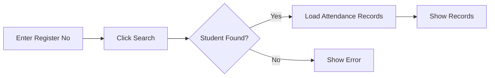
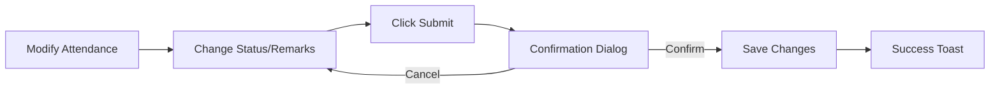

# Attendance Correction Module

## Overview
The Attendance Correction module allows authorized users to search for students and correct their exam attendance records. This is useful for fixing errors made during initial attendance marking.

## Features

### 1. Search Functionality
- **Search by Register Number**: Input field with enter-key support for quick search
- **Real-time validation**: Validates if student exists before showing records
- **User-friendly error messages**: Clear feedback if student not found

### 2. Course Filtering
- **Dynamic filtering**: After loading student records, filter by specific course
- **Record count display**: Shows number of records per course
- **"All Courses" option**: View all attendance records at once
- **Automatic course detection**: Extracts unique courses from student's attendance records

### 3. Attendance Editing
- **Inline editing**: Direct dropdown to change Present/Absent status
- **Visual change tracking**: Yellow highlight for modified records
- **Remarks field**: Add optional notes for each correction
- **Bulk operations**: Change multiple records before submitting

### 4. Change Management
- **Change counter**: Shows pending changes count in student info card
- **Change indicator**: Visual badge on modified records in table
- **Validation**: Prevents submission without changes

### 5. Confirmation & Safety
- **Confirmation dialog**: Two-step confirmation before saving
- **Change summary**: Shows count of records being modified
- **Warning message**: Alerts about permanent nature of changes
- **Success feedback**: Green toast notification after successful update

## User Interface

### Search Section
```
┌─────────────────────────────────────────┐
│ 🔍 Search Student                       │
├─────────────────────────────────────────┤
│ Student Register Number *               │
│ [Enter register number...]  [Search]   │
└─────────────────────────────────────────┘
```

### Student Information Card (After Search)
```
┌─────────────────────────────────────────┐
│ Register Number | Student Name | Total  │
│    23CS101      |  John Doe    |   5    │
│                                         │
│ ⚠️ 2 changes pending submission         │
└─────────────────────────────────────────┘
```

### Course Filter (Optional - shown if multiple courses)
```
┌─────────────────────────────────────────┐
│ Filter by Course: [All Courses (5) ▼]  │
└─────────────────────────────────────────┘
```

### Attendance Records Table
```
┌───────────────────────────────────────────────────────────────────┐
│ S.No | Register | Program | Course | Date | Session | Attendance│
├───────────────────────────────────────────────────────────────────┤
│  1   | 23CS101  | CS101   | DS301  | ...  |   FN    | [Present▼]│
│  2   | 23CS101  | CS101   | DS302  | ...  |   AN    | [Absent▼] │
└───────────────────────────────────────────────────────────────────┘
```

## API Endpoints

### GET `/api/attendance-correction?register_no={register_no}`
**Purpose**: Fetch all attendance records for a student

**Response**:
```json
{
  "student": {
    "register_no": "23CS101",
    "name": "John Doe"
  },
  "records": [
    {
      "id": "uuid",
      "stu_register_no": "23CS101",
      "student_name": "John Doe",
      "program_code": "CS101",
      "program_name": "B.Sc. Computer Science",
      "course_code": "DS301",
      "course_name": "Data Structures",
      "exam_date": "2025-10-15",
      "session": "FN",
      "attendance_status": "Present",
      "remarks": ""
    }
  ]
}
```

**Error Responses**:
- `404`: Student not found
- `400`: Missing register number
- `500`: Server error

### PUT `/api/attendance-correction`
**Purpose**: Update attendance records

**Request Body**:
```json
{
  "records": [
    {
      "id": "uuid",
      "attendance_status": "Absent",
      "status": true,
      "remarks": "Medical emergency"
    }
  ]
}
```

**Response**:
```json
{
  "message": "Successfully updated 2 attendance records",
  "updated_count": 2
}
```

**Error Responses**:
- `400`: No records provided
- `500`: Update failed

## Database Schema

### Tables Used
1. **students**: Student information
2. **exam_registrations**: Links students to exams
3. **exam_attendance**: Attendance records (main table)
4. **programs**: Program details
5. **courses**: Course details
6. **exam_timetables**: Exam schedule details

### Relationships
```
students (id) → exam_registrations (student_id) → exam_attendance (exam_registration_id)
exam_attendance (program_id) → programs (id)
exam_attendance (course_id) → courses (id)
exam_attendance (exam_timetable_id) → exam_timetables (id)
```

## Workflow

### 1. Search Student


### 2. Edit & Submit


## File Structure

```
app/
├── (authenticated)/
│   └── attendance-correction/
│       └── page.tsx                    # Main page component
└── api/
    └── attendance-correction/
        └── route.ts                    # API endpoints (GET, PUT)

components/
└── app-sidebar.tsx                     # Updated with new navigation item
```

## Key Features Implementation

### 1. Dual State Management
- `allRecords`: Stores all attendance records
- `attendanceRecords`: Stores filtered/displayed records
- Changes update both states to maintain consistency

### 2. Change Tracking
```typescript
// Track original status
record.original_status = record.attendance_status

// Detect changes
const hasChanged = record.attendance_status !== record.original_status
```

### 3. Filtering
```typescript
// Filter by course
if (courseCode === "all") {
  setAttendanceRecords(allRecords)
} else {
  const filtered = allRecords.filter(r => r.course_code === courseCode)
  setAttendanceRecords(filtered)
}
```

### 4. Bulk Update
```typescript
// Only send changed records
const changedRecords = allRecords.filter(record =>
  record.attendance_status !== record.original_status ||
  record.remarks !== (record.remarks || '')
)
```

## Security Considerations

1. **Authorization**: Only authorized users can access this page
2. **Validation**: Server-side validation of student and record existence
3. **Audit Trail**: Updates include timestamp (`updated_at`)
4. **Confirmation**: Two-step confirmation prevents accidental changes
5. **Read-only IDs**: Record IDs cannot be modified, only attendance status and remarks

## User Permissions

Required permissions (to be configured in RBAC):
- `attendance:read` - View attendance records
- `attendance:update` - Modify attendance records

## Navigation

**Path**: During-Exam → Attendance Correction

**Icon**: Edit (Pencil) icon

## Toast Notifications

1. **Success Messages**:
   - ✅ Records Loaded
   - ✅ Attendance Updated

2. **Error Messages**:
   - ❌ Search Failed
   - ❌ Update Failed

3. **Info Messages**:
   - ℹ️ No Records Found
   - ℹ️ No Changes

4. **Warning Messages**:
   - ⚠️ Input Required

## Best Practices

1. **Always search first**: Records load automatically after search
2. **Use course filter**: For students with many courses, filter to specific course
3. **Review changes**: Check the yellow-highlighted records before submitting
4. **Add remarks**: When correcting attendance, add explanation in remarks
5. **Confirm carefully**: Changes are permanent after confirmation

## Future Enhancements

1. **Batch correction**: Upload CSV to correct multiple students
2. **History tracking**: View audit log of all corrections
3. **Approval workflow**: Require supervisor approval for corrections
4. **Notification**: Email student when attendance is corrected
5. **Reports**: Generate correction reports for audit purposes

## Testing

### Manual Testing Checklist

- [ ] Search with valid register number
- [ ] Search with invalid register number
- [ ] Filter by specific course
- [ ] Change attendance status
- [ ] Add remarks
- [ ] Submit without changes (should warn)
- [ ] Submit with changes (should confirm)
- [ ] Cancel operation
- [ ] Verify changes in database

### Test Cases

1. **Search existing student**: Should load all attendance records
2. **Search non-existent student**: Should show "Student not found"
3. **Filter by course**: Should show only records for that course
4. **Edit filtered record**: Should update both filtered and all records
5. **Submit changes**: Should save only changed records
6. **Empty remarks**: Should allow submission without remarks

## Troubleshooting

### Issue: "Student not found"
**Solution**: Verify student exists in `students` table with exact register number

### Issue: "No attendance records found"
**Solution**: Check if student has exam registrations and attendance entries

### Issue: Changes not saving
**Solution**: Check network tab for API errors, verify permissions

### Issue: Course filter not working
**Solution**: Ensure student has attendance for multiple courses

## Related Documentation

- [Exam Attendance Module](./app/(authenticated)/exam-attendance/page.tsx)
- [API Routes Guide](./CLAUDE.md#api-error-handling)
- [RBAC Implementation](./CLAUDE.md#authentication--authorization)
