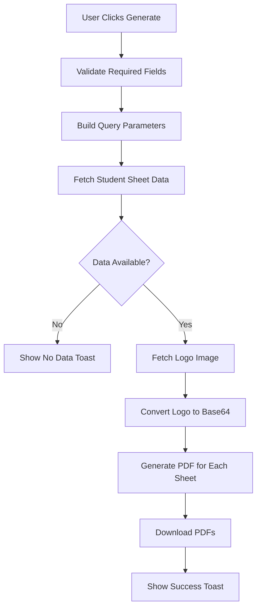
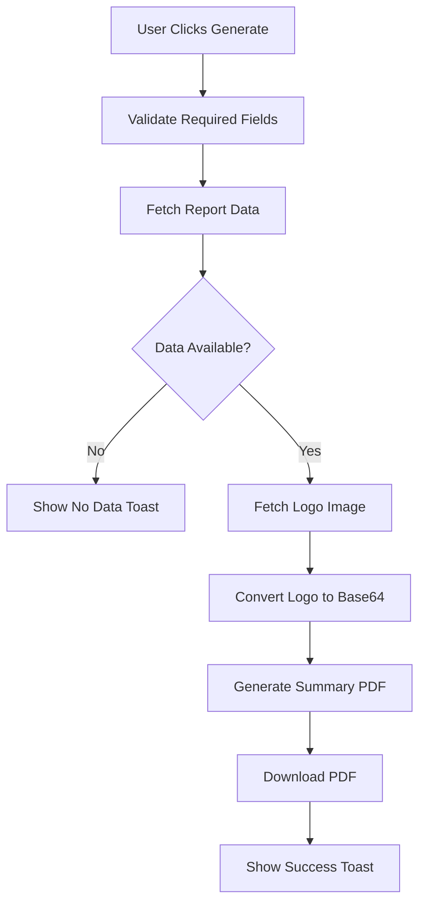

# Attendance Reports Page Documentation

## Overview

The Attendance Reports page (`app/(authenticated)/reports/attendance/page.tsx`) is a comprehensive reporting interface that allows users to generate two types of PDF reports for exam attendance data:

1. **Student Attendance Sheet** - Individual student-wise attendance records
2. **Summary Report** - Aggregated attendance statistics

## File Location

- **Page Component**: [app/(authenticated)/reports/attendance/page.tsx](../app/(authenticated)/reports/attendance/page.tsx)
- **Student Sheet PDF Generator**: [lib/utils/generate-student-attendance-sheet-pdf.ts](../lib/utils/generate-student-attendance-sheet-pdf.ts)
- **Summary Report PDF Generator**: [lib/utils/generate-exam-attendance-pdf.ts](../lib/utils/generate-exam-attendance-pdf.ts)
- **Student Sheet API**: [app/api/exam-attendance/student-sheet/route.ts](../app/api/exam-attendance/student-sheet/route.ts)
- **Summary Report API**: [app/api/exam-attendance/report/route.ts](../app/api/exam-attendance/report/route.ts)
- **Dropdowns API**: [app/api/exam-attendance/dropdowns/route.ts](../app/api/exam-attendance/dropdowns/route.ts)

## Features

### Dynamic Filter System

The page implements a cascading filter system with the following hierarchy:

```
Institution (Required)
  └─→ Examination Session (Required)
        ├─→ Exam Date (Optional)
        ├─→ Session Type (FN/AN) (Optional)
        ├─→ Program (Optional)
        │     └─→ Course (Optional, depends on Program)
```

### Filter Cascade Logic

1. **Institution Selection** → Triggers:
   - Fetch examination sessions for selected institution
   - Reset all dependent filters (session, date, session type, program, course)

2. **Session Selection** → Triggers:
   - Fetch exam dates for selected session
   - Fetch programs for selected institution + session
   - Reset dependent filters (date, session type, program, course)

3. **Program Selection** → Triggers:
   - Fetch courses for selected program + session + optional filters
   - Reset course selection

4. **Exam Date/Session Type Change** → Triggers:
   - Re-fetch courses with updated filters

### Report Types

#### 1. Student Attendance Sheet

**Purpose**: Generate individual student-wise attendance records

**Contents**:
- Individual student records with register numbers and names
- Attendance status (PRESENT/ABSENT) for each student
- Exam details (date, session, subject)
- Course and program information
- Institution header with logo

**Required Filters**:
- Institution (required)
- Examination Session (required)

**Optional Filters**:
- Exam Date
- Session Type (FN/AN)
- Program Code
- Course Code

**API Endpoint**: `GET /api/exam-attendance/student-sheet`

**Query Parameters**:
```typescript
{
  session_code: string       // Required
  exam_date?: string        // Optional (YYYY-MM-DD)
  session?: 'FN' | 'AN'     // Optional
  program_code?: string     // Optional
  course_code?: string      // Optional
}
```

**Response Format**:
```typescript
{
  sheets: Array<{
    metadata: {
      exam_date: string
      session: string
      course_code: string
      course_title: string
      program_code: string
      program_name: string
      semester: string
      regulation_code: string
      institution_name: string
      institution_code: string
      session_name: string
    }
    students: Array<{
      register_number: string
      student_name: string
      attendance_status: 'PRESENT' | 'ABSENT'
      program_code: string
      program_name: string
      semester: string
    }>
  }>
}
```

**Generation Process**:


#### 2. Summary Report

**Purpose**: Generate aggregated attendance statistics

**Contents**:
- Total students per exam
- Present/Absent counts
- Attendance percentages
- Overall statistics
- Grouped by date, session, and course

**Required Filters**:
- Institution (required)
- Examination Session (required)

**API Endpoint**: `GET /api/exam-attendance/report`

**Query Parameters**:
```typescript
{
  session_code: string  // Required
}
```

**Response Format**:
```typescript
{
  metadata: {
    institution_name: string
    institution_code: string
    session_name: string
    session_code: string
    session_type: string
    start_date: string
    end_date: string
  }
  records: Array<{
    exam_date: string
    session: string
    course_code: string
    course_title: string
    program_code: string
    program_name: string
    semester: string
    total_students: number
    present_count: number
    absent_count: number
    attendance_percentage: number
  }>
}
```

**Generation Process**:


## State Management

### Filter States
```typescript
// Dropdown data
const [institutions, setInstitutions] = useState<Institution[]>([])
const [sessions, setSessions] = useState<ExaminationSession[]>([])
const [examDates, setExamDates] = useState<ExamDate[]>([])
const [programs, setPrograms] = useState<Program[]>([])
const [courses, setCourses] = useState<Course[]>([])

// Selected values
const [selectedInstitutionId, setSelectedInstitutionId] = useState<string>("")
const [selectedSessionId, setSelectedSessionId] = useState<string>("")
const [selectedExamDate, setSelectedExamDate] = useState<string>("")
const [selectedSessionType, setSelectedSessionType] = useState<string>("")
const [selectedProgramCode, setSelectedProgramCode] = useState<string>("")
const [selectedCourseCode, setSelectedCourseCode] = useState<string>("")
```

### Loading States
```typescript
const [loadingInstitutions, setLoadingInstitutions] = useState(false)
const [loadingSessions, setLoadingSessions] = useState(false)
const [loadingDates, setLoadingDates] = useState(false)
const [loadingPrograms, setLoadingPrograms] = useState(false)
const [loadingCourses, setLoadingCourses] = useState(false)
const [generatingStudentSheet, setGeneratingStudentSheet] = useState(false)
const [generatingSummary, setGeneratingSummary] = useState(false)
```

## API Integration

### Dropdowns API

**Endpoint**: `GET /api/exam-attendance/dropdowns`

**Supported Types**:

1. **Institutions**
   ```
   GET /api/exam-attendance/dropdowns?type=institutions
   ```
   Returns institutions filtered by user's institution_code

2. **Sessions**
   ```
   GET /api/exam-attendance/dropdowns?type=sessions&institution_id={id}
   ```
   Returns examination sessions for institution

3. **Exam Dates**
   ```
   GET /api/exam-attendance/dropdowns?type=exam_dates&session_id={id}
   ```
   Returns unique exam dates for session

4. **Programs**
   ```
   GET /api/exam-attendance/dropdowns?type=programs&institution_id={id}&session_id={id}
   ```
   Returns programs with attendance records

5. **Courses**
   ```
   GET /api/exam-attendance/dropdowns?type=courses&session_id={id}&program_code={code}&exam_date={date}&session_type={type}
   ```
   Returns courses filtered by all provided parameters

## User Experience Features

### 1. Auto-Selection
- Automatically selects institution if only one is available for the user

### 2. Progressive Disclosure
- Shows examination session dropdown only after institution is selected
- Shows optional filters only after session is selected

### 3. Active Filters Summary
- Displays all currently active filters in a visual summary panel
- Color-coded badges for each filter
- Real-time updates as filters change

### 4. Disabled States
- Course dropdown disabled until program is selected
- Generate buttons disabled until required filters are selected
- Loading indicators on all dropdowns during data fetch

### 5. Toast Notifications

**Success Messages**:
```typescript
// Student Sheet Success
✅ Student Sheet Generated
X attendance sheet(s) downloaded successfully.

// Summary Report Success
✅ Summary Report Generated
filename.pdf has been downloaded successfully.
```

**Info Messages**:
```typescript
// No Data Found
ℹ️ No Data
No [student attendance records/attendance records] found for the selected criteria.
```

**Error Messages**:
```typescript
// Validation Error
⚠️ Missing Information
Please select Institution and Examination Session.

// Generation Error
❌ Generation Failed
[Specific error message]
```

## UI Components Used

### Layout Components
- `SidebarProvider` - Main layout provider
- `AppSidebar` - Navigation sidebar
- `SidebarInset` - Content area
- `AppHeader` - Page header
- `AppFooter` - Page footer
- `Breadcrumb` - Navigation breadcrumb

### Form Components
- `Card` - Container cards for sections
- `Select` - Dropdown filters
- `Button` - Action buttons
- `Label` - Form labels

### Feedback Components
- `useToast` - Toast notifications
- `Loader2` - Loading spinner icons

### Icons
- `FileSpreadsheet` - Student sheet icon
- `FileText` - Summary report icon
- `Calendar` - Date picker icon

## Styling and Design

### Report Type Cards

Both report types use gradient-styled cards with distinct color schemes:

**Student Attendance Sheet**:
- Gradient: Green to Emerald
- Header: `from-green-50 to-emerald-50`
- Icon Circle: `from-green-500 to-emerald-600`
- Button: `from-green-600 to-emerald-600`

**Summary Report**:
- Gradient: Blue to Indigo
- Header: `from-blue-50 to-indigo-50`
- Icon Circle: `from-blue-500 to-indigo-600`
- Button: `from-blue-600 to-indigo-600`

### Active Filters Panel
```typescript
<div className="p-3 bg-blue-50 dark:bg-blue-900/20 border border-blue-200 dark:border-blue-800 rounded-lg">
  {/* Color-coded filter badges */}
  <span className="text-xs bg-blue-100 dark:bg-blue-900 text-blue-800 dark:text-blue-200 px-2 py-1 rounded">
    Institution: {code}
  </span>
</div>
```

## Database Tables Involved

### Direct Usage
- `institutions` - Institution master data
- `examination_sessions` - Examination session records
- `programs` - Program master data
- `courses` - Course master data
- `exam_attendance` - Attendance records

### Supabase Functions
- `get_exam_attendance_student_sheet()` - Returns student-wise attendance
- `get_exam_attendance_report()` - Returns aggregated statistics

## Security Considerations

1. **User Institution Filtering**: Institutions are automatically filtered by user's `institution_code` on server side
2. **Session Validation**: Requires authenticated user session
3. **Input Sanitization**: All query parameters are validated on server
4. **Logo Security**: Logo fetched from public directory, converted to base64 on client side

## Performance Optimizations

1. **Conditional Fetching**: Dropdowns only fetch when parent filter is selected
2. **Auto-Selection**: Single institution auto-selected to reduce clicks
3. **Reset on Change**: Dependent filters reset when parent changes to prevent stale data
4. **Loading States**: Individual loading states for each dropdown prevent UI blocking

## Error Handling

### Client-Side Validation
```typescript
if (!selectedInstitutionId || !selectedSessionId) {
  toast({
    title: "⚠️ Missing Information",
    description: "Please select Institution and Examination Session.",
    variant: "destructive",
  })
  return
}
```

### API Error Handling
```typescript
try {
  const response = await fetch(apiUrl)
  if (!response.ok) {
    const errorData = await response.json()
    throw new Error(errorData.error || 'Failed to fetch data')
  }
  // Success handling
} catch (error) {
  const errorMessage = error instanceof Error
    ? error.message
    : 'Failed to generate report'
  toast({
    title: "❌ Generation Failed",
    description: errorMessage,
    variant: "destructive",
  })
}
```

## Future Enhancements

### Potential Features
1. **Date Range Selection**: Allow selecting start/end date range instead of single date
2. **Export Formats**: Add CSV/Excel export options alongside PDF
3. **Email Reports**: Option to email generated reports
4. **Scheduled Reports**: Auto-generate and email reports on schedule
5. **Batch Download**: Download all filtered reports as ZIP
6. **Preview Mode**: Preview PDF before downloading
7. **Custom Templates**: Allow institutions to customize report templates
8. **Report History**: Track previously generated reports
9. **Comparison Reports**: Compare attendance across different sessions
10. **Analytics Dashboard**: Visual charts and graphs for attendance trends

### Technical Improvements
1. **Caching**: Cache dropdown data to reduce API calls
2. **Pagination**: Add pagination for large result sets
3. **Background Processing**: Generate large reports in background with progress tracking
4. **PDF Optimization**: Compress PDFs for faster downloads
5. **Offline Support**: Cache critical data for offline report generation

## Testing Checklist

### Filter Functionality
- [ ] Institution dropdown loads and auto-selects single option
- [ ] Session dropdown appears after institution selection
- [ ] Exam dates populate after session selection
- [ ] Programs populate after session selection
- [ ] Courses populate after program selection
- [ ] Courses filter by exam date when selected
- [ ] Courses filter by session type when selected
- [ ] All filters reset correctly on parent change

### Report Generation
- [ ] Student sheet generates with required filters only
- [ ] Student sheet generates with all optional filters
- [ ] Summary report generates successfully
- [ ] Multiple sheets download correctly
- [ ] Logo appears in all PDFs
- [ ] No data message shows when no records found
- [ ] Error handling works for API failures

### UI/UX
- [ ] Loading indicators show during data fetch
- [ ] Buttons disable appropriately
- [ ] Toast messages are clear and accurate
- [ ] Active filters summary updates correctly
- [ ] Dark mode styling works properly
- [ ] Responsive design works on mobile
- [ ] Breadcrumb navigation is correct

## Related Documentation

- [EXAM_ATTENDANCE_PDF_REPORT.md](./EXAM_ATTENDANCE_PDF_REPORT.md) - Summary Report PDF generation details
- [STUDENT_ATTENDANCE_SHEET_IMPLEMENTATION.md](./STUDENT_ATTENDANCE_SHEET_IMPLEMENTATION.md) - Student Sheet implementation details
- [STUDENT_ATTENDANCE_SHEET_SUMMARY.md](./STUDENT_ATTENDANCE_SHEET_SUMMARY.md) - Student Sheet feature summary

## Changelog

### Version 1.0.0 (Current)
- Initial implementation with dual report generation
- Cascading filter system
- Institution-based access control
- Auto-selection for single institutions
- Active filters summary panel
- Comprehensive error handling
- Dark mode support
